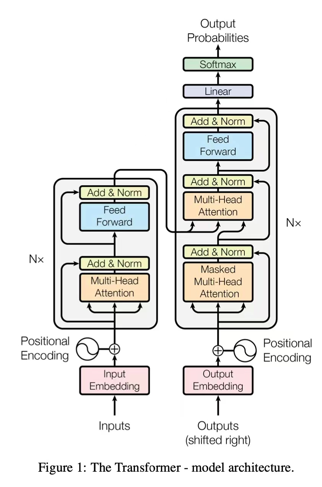
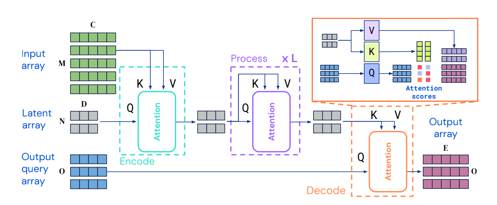
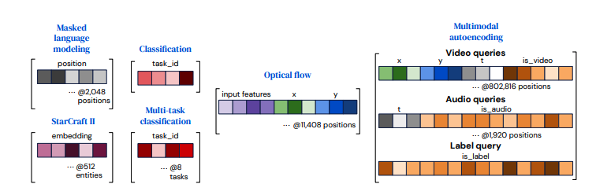

# Perceiver IO: A General Architecture for Structured Inputs & Outputs Summary

## Overview

### Discussion
- Recall the architecture of transformers, what are some of the components?

---

Current architectures cannot be applied beyond a small set of stereotyped settings, as they bake in domain & task assumptions or scale poorly to large inputs or outputs. Therefore, in this study, the researchers proposed Perceiver IO, a general-purpose architecture that handles data from arbitrary settings while scaling linearly with the size of inputs and outputs.

- Proposed an architecture, with the ultimate goal of building a network that can easily integrate and transform arbitrary information for arbitrary tasks.
- Perceiver IO does this using a fully attentional read-process-write architecture: inputs are encoded (read) to a latent space, the latent representation is refined (process) via many layers of processing, and the latent space is decoded (write) to produce outputs.
- The proposed architecture can be applied with unprecedented levels of generality. 

## Related Work

### Discussion
- When do you think the earliest trials to realize high-dimensional inputs take place?

---

1994, Hinton & Zemel, Autoencoding: encode and reproduce high-dimensional inputs like images             
Since 2012, Krizhevsky et al. and many other reseachers, Neural nets led to breakthroughs in image understanding             
Since 2011, Collobert et al., natural language applications research has made extensive progressive in capturing the structured nature of language, typically via autoregressive models                   
Since 2017, Kaiser et al. , several groups have proposed to solve tasks in multiple domains      
...              
Several groups have proposed to use attention to manipulate the size of arrays or to introduce bottlenecks in processing            

## The Perceiver IO Architecture

They first encode by applying an attention module that maps input arrays to arrays in a latent space. Then process the latents z by applying a series of modules that take in and return arrays in this latent space. Finally, decode by applying an attention module that maps latent arrays to output arrays y. M , C, O, and E are properties of the task data and can be very large, while N and D are hyperparameters and can be chosen to make model computation tractable. 

Each of these modules applies a global query-key-value (QKV) attention operation followed by a multi-layer perceptron (MLP). As usual in Transformer-style architectures, we apply the MLP independently to each element of the index dimension. Both encoder and decoder take in two input arrays, the first used as input to the module’s key and value networks, and the second used as input to the module’s query network. The module’s output has the same index dimension (the same number of elements) as the query input.

### Discussion
With transformer, why we have limited text size? Or why aren’t Transformers all you need?

---

- Due to its self-attention mechanism, it scales very poorly in both compute and memory. In every layer, all inputs are used to produce queries and keys, for which a pairwise dot product is computed. Hence, it is not possible to apply self-attention on high-dimensional data without some form of preprocessing.

---

Perceiver IO uses attention non-homogeneously by mapping inputs to a latent space, processing in that latent space, and decoding to an output space. It has no quadratic dependence on the input or output size: encoder and decoder attention modules depend linearly on the input and output size (respectively), while latent attention is independent of both input and output sizes. Because of the corresponding reduction in compute and memory requirements, it can scales to much larger inputs and outputs.        

      

This architecture can be applied to inputs of any shape or spatial layout including inputs or outputs with different spatial structure. In contrast to latent spaces typically used in vision the latent does not explicitly share the structure of the inputs. To decode this information, they query for it using cross-attention.

### Decoding the latent representation with a query array

They produce an output of this size by querying the decoder with an array of index dimension O. To capture the structure of the output space, they use queries containing the appropriate information for each output point.      
Construct queries by combining a set of vectors into a query vector containing all of the information relevant for one of the O desired outputs.      
- For tasks with simple outputs, such as classification, these queries can be reused for every example and can be learned from scratch. 
- For outputs with a spatial or sequence structure, they include a position encoding representing the position to be decoded in the output. 
- For outputs with a multi-task or multimodal structure, they learn a single query for each task or for each modality。

Each output point depends only on its query and the latent array, allowing to decode outputs in parallel. This property allows them to amortize model training on datasets of very large output size.       

## Experiments

To probe the generality of Perceiver IO, they evaluate it on several domains. s including language understanding (Wikipedia+C4 masked language modeling), visual understanding, multi-modal  & multi-task settings , and symbolic representations for games. All experiments were conducted using JAX and the DeepMind JAX ecosystem. 

### Language
The experiments focus on showing that Perceiver IO performs as well as or better than Transformers for masked language modeling (MLM) while removing tokenization.
Evaluated the quality of the learned representation on the GLUE benchmark
- Pretraining. Pretrained on the Masked Language Modeling (MLM), masked 15% of the words. Perceiver IO produces one output vector per masked input by using learnable position-dependent vectors to query the output of the final latent processing layer. 
- Finetuning. Finetuned Perceiver IO on the GLUE Benchmark Wang et al.
- Perceiver IO on SentencePiece tokens. 
- Perceiver IO on UTF-8 bytes.

### Optical Flow
Optical flow is a decades-old open problem in computer vision. Given two images of the same scene (e.g. two consecutive frames of a video), the
task is to estimate the 2D displacement for each pixel in the first image.       

### Multimodal Autoencodidng
Explored using Perceiver IO for audio-video-label multimodal autoencoding on the Kinetics700-2020 dataset. The goal of multimodal autoencoding is to learn a model that can accurately reconstruct multimodal inputs in the the presence of a bottleneck induced by an architecture. 

### Imagenet, Starcraft II, and Audioset

## Conclusion

In this work the researchers introduce Perceiver IO, an architecture capable of handling general purpose inputsand outputs while scaling linearly in both input and output sizes. This architectureachieves good results in a wide variety of settings, making it a promising candidate for a general purpose neural network architecture.           
Perceiver IO leverages the expressive power of **latent attention and uses learned queries** to expose a simple and unified interface that can handle multimodal and multitask settings. Overall, Perceiver IO offers a promising way to simplify the construction of sophisticated neural pipelines and facilitate progress on multimodal and multiask problems.

## Critical Analysis

Good sides:
- The idea of perceiver IO is novel and solid -- a general architecture capable of handling general-purpose inputs and outputs across different tasks and modalities. This is very promising to simplify the construction of highly tuned task-specific neural pipelines and improve the multimodal and multi-task problems.

- The proposed architecture is tested on massive experiments including language understanding tasks, optical flow, video audio class autoencoding, image classification, and starcraft II and achieves superior performance. Each task is supported with a detailed ablation study to shed light on future research.

Weakness:
- Although perceiver IO removes the task-specific pre-processing, the model still requires huge engineering efforts to adapt the model for different tasks. For example, the model hyper-parameters are quite different for different tasks.
- Didn't discuss for tasks that require more information on prior decoding context (machine translation or image generation tasks), whether the proposed model can still perform well on those tasks.

## Resources:

[Original Paper](https://arxiv.org/abs/2107.14795) Perceiver IO: A General Architecture for Structured Inputs & Outputs          
[HuggingFace Blog](https://huggingface.co/blog/perceiver) Perceiver IO: a scalable, fully-attentional model that works on any modality
